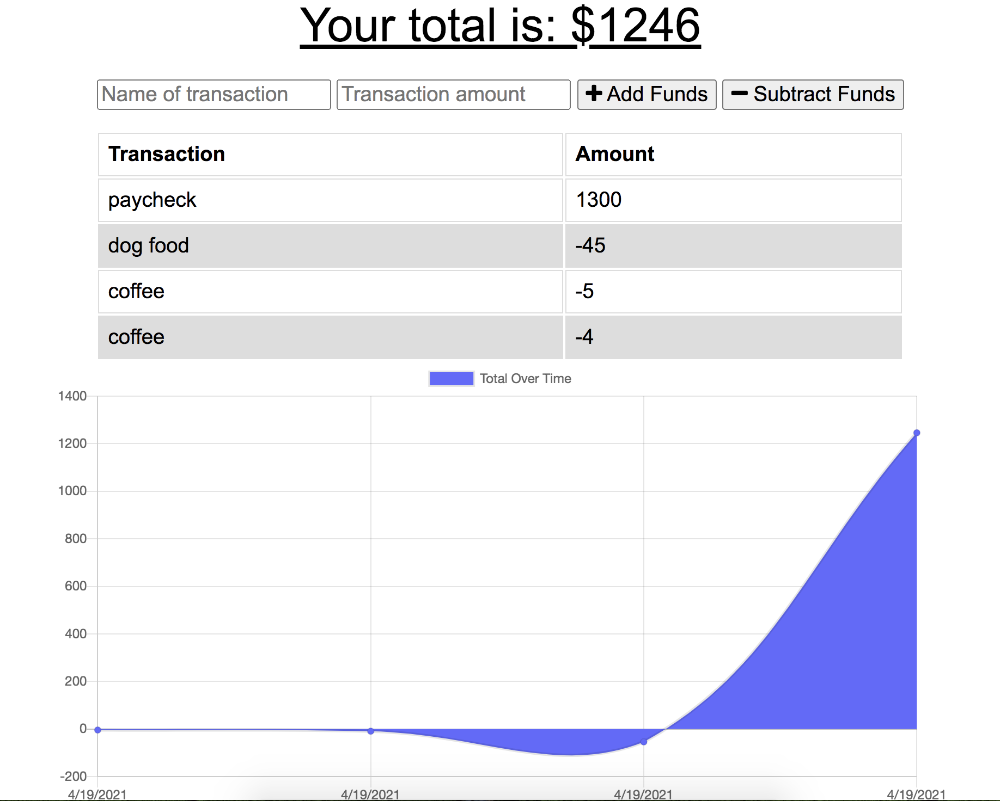

# online-offline-budget-tracker

## Overview
 This application was created to be able to add data into a form with or without an internet connection. By having this functionality, is important for both the user experience and in the business context.

## Index

* Installation

* Dependencies

* Testing

* Questions/ Contact

## Installation:

After cloning down the repo, be sure to install all node.js dependancies with the command npm i in the integrated terminal.
Ensure your MongoDB database is running locally on your machine. Enter npm start to start the local server, default port is 8000.

## Built with:

- HTML
- CSS/ Bootstrap
- JavaScript
- Morgan 
- Mongoose
- Express

## Dependencies:

Express 
mongoose
morgan

## Testing:
n/a

## Questions/ Contact:

  If you need to contact me, please email me at dobsonemily@gmail.com 

### Heroku link:

https://budget-tracker-emd.herokuapp.com/

### Still Image of app:

